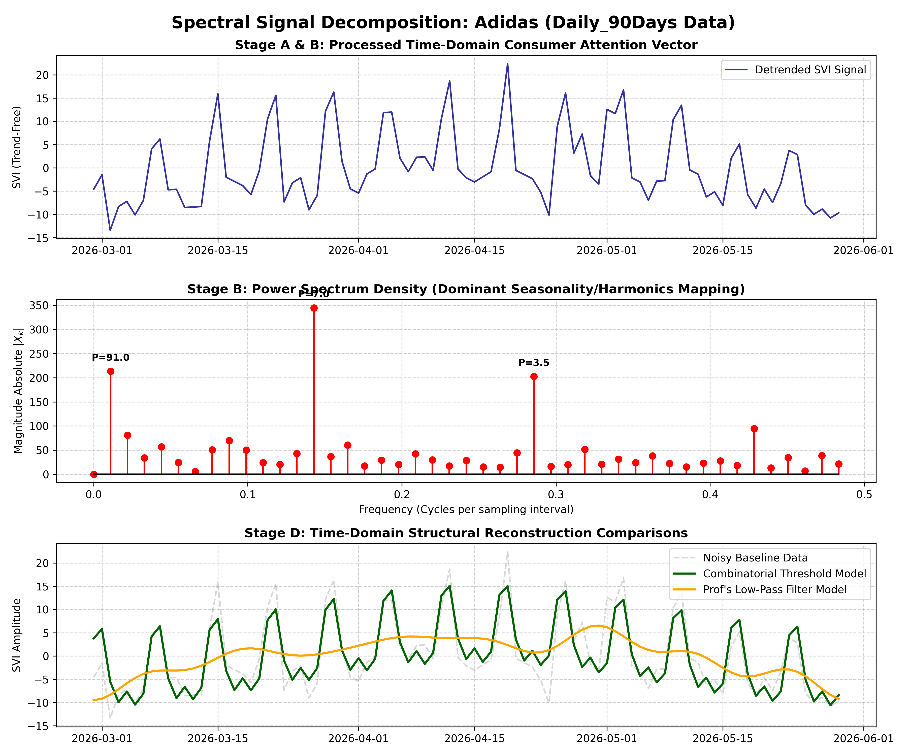
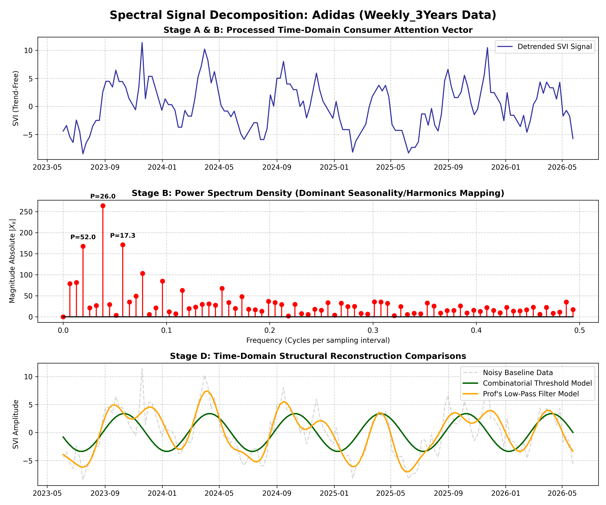
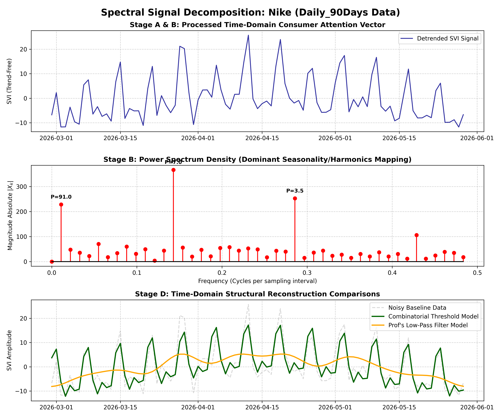
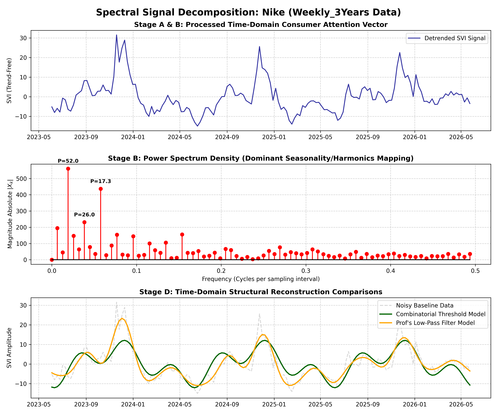

# Spectral Data Analysis of Retail Consumer Attention Cycles

An advanced signal processing pipeline built from scratch to analyze and decompose digital consumer behavior matrices for **Nike** and **Adidas** within the Italian retail geography ($geo='IT'$).

---

## Project Abstract & Objective
Daily Search Volume Index (SVI) data is heavily distorted by stochastic behavioral noise. This project implements the **Discrete Fourier Transform (DFT)** via Fast Fourier Transform (FFT) algorithms to transition time-series consumer data into the frequency domain. 

The objective is to statistically verify whether public interest is sustained by predictable lifestyle harmonics (regular weekly/monthly cycles) or driven by transient stochastic shocks (hype cycles, limited product drops, or sports events).

---

## Core Empirical Results & Visualizations

### 1. Adidas Spectral Analysis (The Lifestyle Rhythm)
Adidas exhibits a clean frequency spectrum heavily dominated by structured human behavior and standard retail calendars.

* **Daily Resolution (90 Days):** Shows a powerful, sharp resonance spike at exactly $P = 7.0$ days, proving a strict weekend-driven retail browsing loop.
* **Weekly Resolution (3 Years):** Strongly dominated by annual seasonality ($P = 52.0$ weeks) and semi-annual adjustments ($P = 26.0$ weeks).




---

### 2. Nike Spectral Analysis (The Scarcity Impulse Train)
Nike's spectrum mathematically validates the "Impulse Train" hypothesis, showing a behaviorscape driven by dynamic shocks rather than steady routine.

* **Daily Resolution (90 Days):** Shares the universal $P = 7.0$ days weekly pulse but operates on a much noisier baseline variance floor.
* **Weekly Resolution (3 Years):** Displays a dense cluster of high-frequency components concentrated between $P = 2.5$ to $3.5$ weeks, capturing the transient bursts of limited sneaker drops and transient hype marketing.




---

## Computational Architecture & Pipeline Stages

### Stage A & B: Data Ingestion & Linear Detrending
* **Extraction:** Automated pipeline using `pytrends` API fetching 90-day daily blocks and 3-year weekly blocks.
* **Detrending:** Application of SciPy's linear detrending operators to drop macro internet growth trends and minimize spectral leakage.

### Stage C: Dual-Filtering Execution
1. **Combinatorial Threshold Filter:** Isolates high-amplitude seasonal frequencies while wiping out weak background noise.
2. **Low-Pass Filter (Suggested by Prof. Strazzanti):** Retains frequencies close to zero to isolate smooth macro-cycles and eliminate high-frequency turbulence.

### Stage D: Time-Domain Inverse Transformation
* Reconstructs the cleaned frequency matrices back into real-valued continuous time-series models using the **Inverse Fast Fourier Transform (IFFT)**.

---

## How to Run the Pipeline

1. Install dependencies:
   ```bash
   pip install -r requirements.txt
   ```
2. Run the master orchestrator to download data, apply Fourier equations, and output charts:
   ```bash
   python main.py
   ```
   
